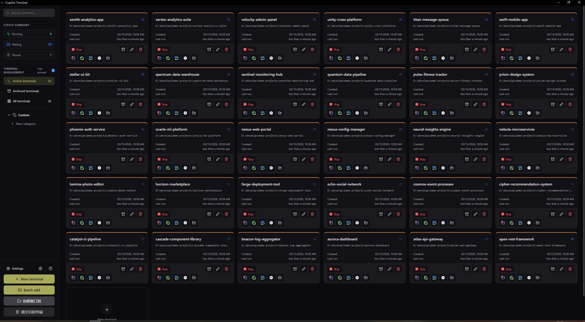
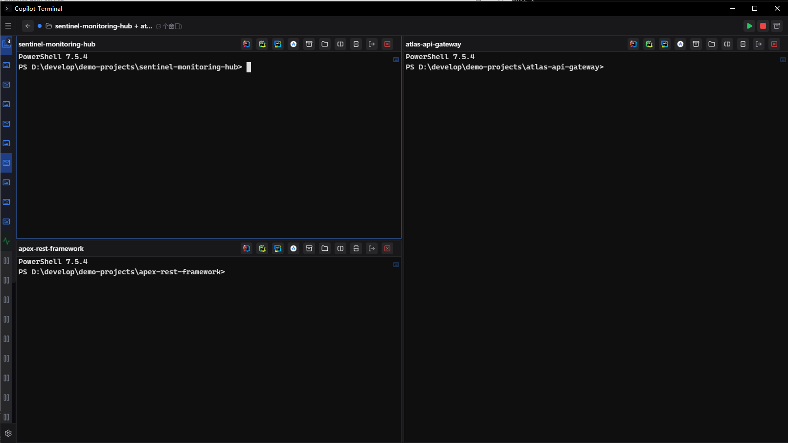
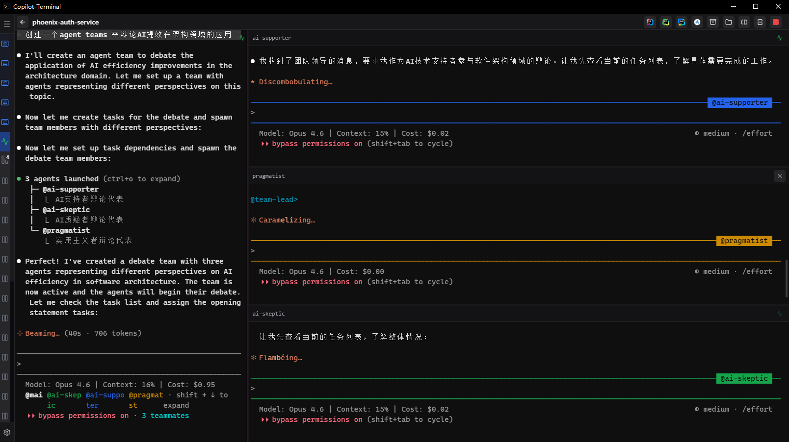

# Copilot-Terminal

[English](docs/README.en.md) | [简体中文](docs/README.zh-CN.md)

A modern terminal window manager designed for “multi-project, multi-terminal, multi-context” daily development scenarios.

It provides a unified card view to manage multiple project terminals and an immersive terminal view for focused operations, perfect for maintaining multiple code repositories, AI coding sessions, and local development environments simultaneously.

## Homepage Preview



> The repository currently lacks real interface screenshots. The above preview image shows the overall layout. Real screenshots can be added later by replacing this image resource.

## Why Use It

- **Unified management of multiple project terminals**: No more switching between system terminals and multiple tabs
- **Terminal bound to project context**: Window cards directly display working directory, Git branch, project links, and status information
- **Perfect for AI-assisted development**: Supports Claude StatusLine information display for tracking model and context usage
- **Better for long-term development sessions**: Supports workspace auto-save, crash recovery, and history state restoration
- **Reduced context switching cost**: Supports project links, quick navigation, and IDE project opening

## Core Features

- Multiple terminal window management with unified overview and immersive terminal view switching
- Horizontal/vertical pane splitting with unified recursive layout model
- **Window groups**: Organize multiple windows into logical groups with split-pane layout
  - Batch operations: Start All, Pause All, Archive, Delete
  - Visual status indicators: Each window shows its status with icon badges
  - Status aggregation: Group cards display all window statuses at a glance
  - Dedicated GroupView: Full-screen split-pane view for working with multiple windows



- **tmux compatibility layer**: Built-in fake tmux for Claude Code Agent Teams
  - No real tmux installation required
  - Intercepts `tmux` commands via Named Pipe / Unix Socket RPC
  - Supports core subcommands: `split-window`, `send-keys`, `select-pane`, `list-panes`
  - Auto-injects `TMUX`, `TMUX_PANE` environment variables for compatibility



- **Claude StatusLine integration**: Real-time display of AI coding context
  - Shows current model (Opus/Sonnet/Haiku) and version
  - Displays context usage (tokens used / total capacity)
  - Tracks estimated cost per session
  - Updates automatically via Named Pipe communication
  - Helps manage context limits during long coding sessions
- `Ctrl+Tab` quick window switching, `Ctrl+1~9` numbered navigation
- Project link configuration: Place `copilot.json` in project root to display quick access buttons
- Quick navigation panel: Supports URLs and local folders, activated by double-tapping `Shift`
- Workspace auto-save, crash recovery, window state restoration
- Git branch and window status display
- Open project directories directly in common IDEs from the app

## Quick Start

> **Windows Users**: For the best terminal experience, we strongly recommend using **PowerShell 7** (pwsh) as your default shell. It offers better Unicode support, performance, and cross-platform compatibility compared to PowerShell 5.1 or cmd.exe.
>
> Download: [PowerShell/PowerShell](https://github.com/PowerShell/PowerShell) (GitHub Releases)

### Option 1: Download Installer (Recommended for Users)

1. Open the [Releases page](../../releases)
2. Download the installer or archive for your system
3. Install and launch the app

### Option 2: Run from Source (Recommended for Developers)

1. First read [xterm.js Custom Package Constraint](docs/xterm-custom-package-constraint.md)
2. Prepare the local `xterm.js` custom tgz package as specified
3. Install dependencies

   ```bash
   npm install
   ```

4. Start development environment

   ```bash
   npm run dev
   ```

5. To build installer packages, run

   ```bash
   npm run dist
   ```

## Documentation

- [Complete Chinese Documentation](docs/README.zh-CN.md)
- [Complete English Documentation](docs/README.en.md)
- [User Manual (Chinese)](docs/user-manual-zh.md)
- [User Manual (English)](docs/user-manual-en.md)
- [Project Link Configuration (copilot.json)](docs/project-config.md)
- [Keyboard Shortcuts](docs/keyboard-shortcuts.md)
- [Quick Navigation Feature](docs/quick-nav-feature.md)
- [Multi-Pane Architecture](docs/pane-architecture.md)
- [Window Group Status Icons Design](docs/窗口组状态图标设计展示方案.md)
- [xterm.js Custom Package Constraint](docs/xterm-custom-package-constraint.md)

## Typical Use Cases

- **Multi-repository parallel development**: One window per project, unified overview on homepage
- **Microservices development**: Batch create multiple service windows, quickly switch between directories
- **AI-assisted coding**: Integrate with Claude Code workflow, centrally manage multiple sessions
- **Project operations troubleshooting**: Attach repository, documentation, monitoring, and log links to project cards

## Important Notes

Before installing from source, please read [xterm.js Custom Package Constraint](docs/xterm-custom-package-constraint.md).

This project depends on a custom-built `xterm.js` package. **Do not change the local dependency in `package.json` to the official npm version or other paths**. This constraint must be clearly documented in the open-source repository for other developers to install from source successfully.

## License

MIT
