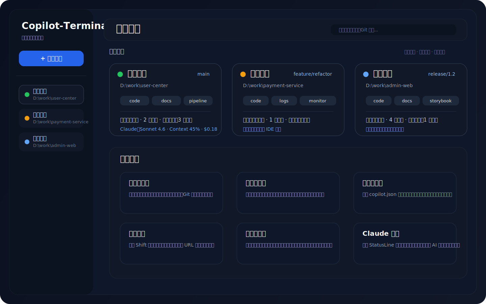

# Copilot-Terminal

[简体中文](docs/README.zh-CN.md) | [English](docs/README.en.md)

一个基于 Electron、React、TypeScript 和 xterm.js 构建的现代终端窗口管理工具，面向“多项目、多终端、多上下文”的日常开发场景。

它提供统一卡片视图来管理多个项目终端，也提供沉浸式终端视图用于专注操作，适合同时维护多个代码仓库、多个 AI 编码会话、多个本地开发环境的场景。

## 主页预览



> 当前仓库暂无现成的真实界面截图，以上先使用主页预览图展示整体布局。后续如果补充真实截图，可以直接替换这里的图片资源。

## 为什么使用它

- **统一管理多个项目终端**：不再在系统终端和多个标签页之间来回切换
- **终端与项目上下文绑定**：窗口卡片可直接展示工作目录、Git 分支、项目链接和状态信息
- **适合 AI 辅助开发**：支持 Claude StatusLine 信息展示，便于跟踪模型和上下文使用情况
- **更适合长期开发会话**：支持工作区自动保存、崩溃恢复和历史状态恢复
- **减少跳转成本**：支持项目链接、快捷导航和 IDE 打开项目

## 核心特性

- 多终端窗口管理，支持统一总览与沉浸式终端视图切换
- 横向 / 纵向拆分窗格，统一的递归布局模型
- `Ctrl+Tab` 快速切换窗口，`Ctrl+1~9` 编号跳转
- 项目链接配置：在项目根目录放置 `copilot.json` 即可显示快捷入口
- 快捷导航面板：支持 URL 和本地文件夹，双击 `Shift` 唤出
- 工作区自动保存、崩溃恢复、窗口状态恢复
- Git 分支、窗口状态、Claude StatusLine 信息展示
- 支持从应用中直接用常见 IDE 打开项目目录

## 快速开始

### 方式一：下载安装包（推荐普通用户）

1. 打开 [Releases 页面](../../releases)
2. 下载适合你系统的安装包或压缩包
3. 安装并启动应用

### 方式二：从源码运行（推荐开发者）

1. 先阅读 [xterm.js 自定义依赖约束](docs/xterm-custom-package-constraint.md)
2. 按约定准备好本地 `xterm.js` 自定义 tgz 包
3. 安装依赖

   ```bash
   npm install
   ```

4. 启动开发环境

   ```bash
   npm run dev
   ```

5. 如果需要打包安装包，可执行

   ```bash
   npm run dist
   ```

## 文档导航

- [中文完整文档](docs/README.zh-CN.md)
- [English documentation](docs/README.en.md)
- [项目链接配置（copilot.json）](docs/project-config.md)
- [快捷键说明](docs/keyboard-shortcuts.md)
- [快捷导航功能说明](docs/quick-nav-feature.md)
- [多窗格架构说明](docs/pane-architecture.md)
- [xterm.js 自定义依赖约束](docs/xterm-custom-package-constraint.md)

## 典型使用场景

- **多仓库并行开发**：一个窗口对应一个项目，主页统一总览
- **微服务开发**：批量创建多个服务窗口，快速切换不同目录
- **AI 辅助编码**：结合 Claude Code 工作流，集中管理多个会话
- **项目运维排查**：把仓库、文档、监控、日志等入口挂到项目卡片上

## 重要说明

源码安装前，请务必先阅读 [xterm.js 自定义依赖约束](docs/xterm-custom-package-constraint.md)。

当前项目依赖自定义打包的 `xterm.js` 产物，**不能直接把 `package.json` 中的本地依赖改成官方 npm 版本或其他路径**。如果要让其他开发者顺利安装源码，这一点需要在开源仓库中明确保留。

## License

MIT
