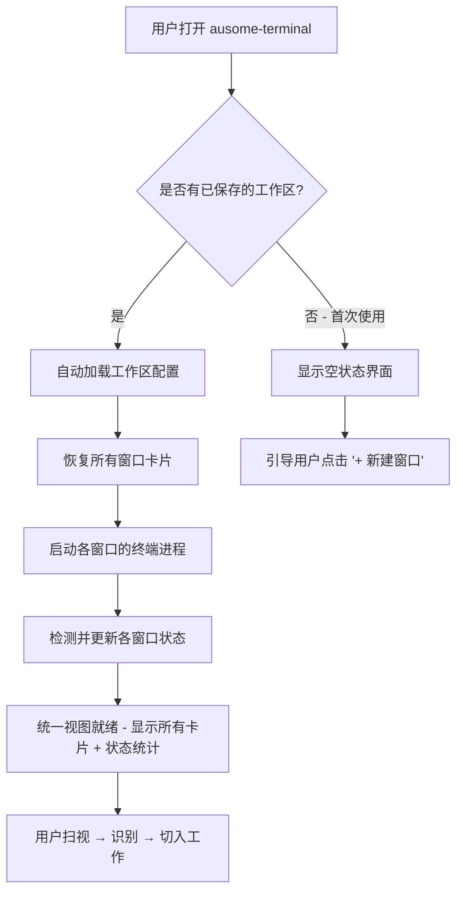
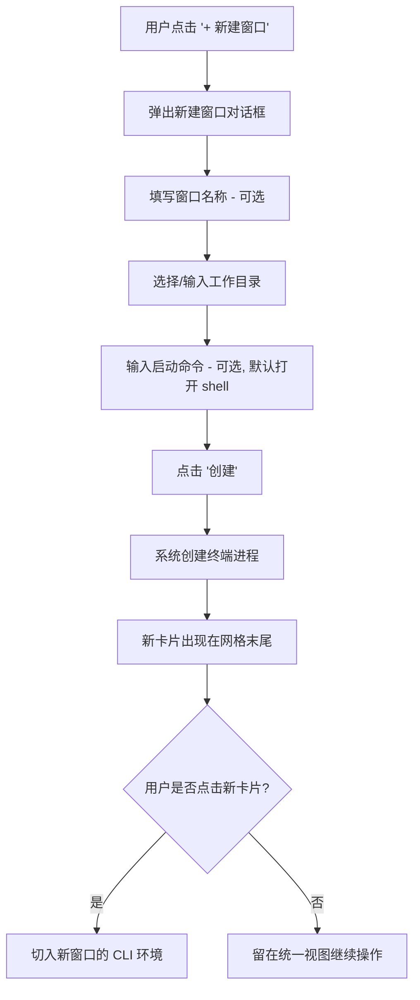
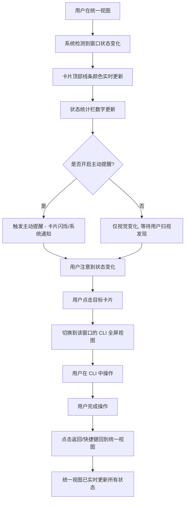
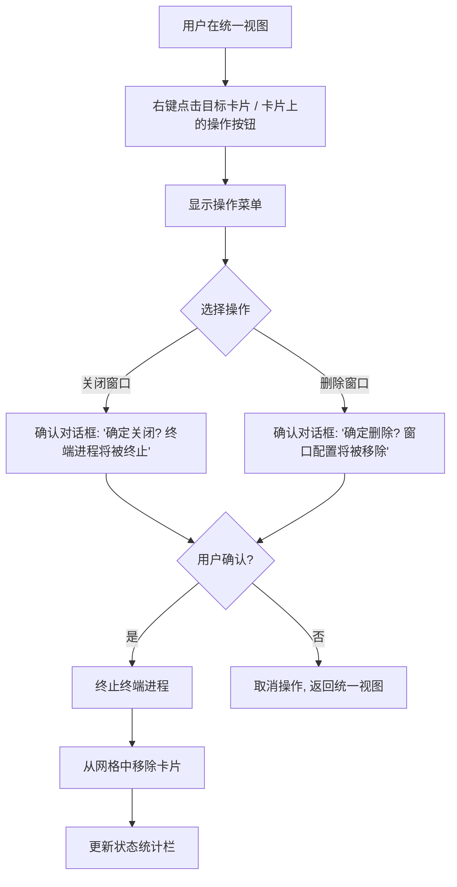

# UX Design Specification ausome-terminal

**Author:** 立哥
**Date:** 2026-02-27

---

<!-- UX design content will be appended sequentially through collaborative workflow steps -->

## Executive Summary

### Project Vision

ausome-terminal 是一款"始终在线"的桌面任务管理软件，面向使用 AI CLI 工具（Claude Code、OpenCode 等）进行多任务并行开发的开发者。它不替代终端，而是作为 shell 工具的增强包装层，将传统的"窗口管理"升级为"任务管理"。

核心 UX 理念：**零认知负担，即开即用。** 用户全天候开着软件，所有任务状态始终可见，无需人工轮询，无需重复配置。

### Target Users

- 使用 AI CLI 工具的开发者，日常管理 10~15+ 个长时间运行的 CLI 窗口
- 技术水平中高级，对工具效率和工作流连贯性有高要求
- 典型角色：独立全栈开发者、团队开发者、技术负责人
- 使用模式：全天候常驻运行，软件作为日常开发的"任务控制中心"
- 平台：Windows（Windows Terminal + pwsh7）、macOS（默认终端 + zsh/bash）

### Key Design Challenges

1. **窗口身份识别** — 用户最大的挫败感是"不知道哪个窗口在干什么"。标签页只显示"pwsh"，毫无辨识度。UX 设计必须让每个窗口的身份和状态在一瞥之间清晰可辨。
2. **状态感知与主动提醒的平衡** — 用户需要视觉变化（颜色编码）+ 主动提醒（如闪烁、弹窗），但也需要能关闭主动提醒以避免干扰。设计需要在"不漏掉"和"不打扰"之间找到平衡。
3. **全天候常驻体验** — 软件全天开着，必须保证长时间运行的稳定性、低资源占用，以及视觉上不疲劳的界面设计。
4. **冷启动体验** — 每天开机后零配置恢复所有窗口，从"15 分钟准备工作"到"即开即用"，这是核心"啊哈"时刻。

### Design Opportunities

1. **任务级视觉语言** — 通过颜色编码、状态图标、工作目录显示，建立一套直觉化的任务状态视觉系统，让用户 10 秒内掌握全局。
2. **渐进式提醒机制** — 从静默的颜色变化到主动提醒（闪烁/通知），用户可自定义提醒强度，既不漏掉关键任务，又不破坏心流。
3. **"控制中心"式布局** — 借鉴任务控制台/仪表盘的设计模式，让统一视图成为开发者的"指挥中心"，一个界面掌控所有并行任务。

## Core User Experience

### Defining Experience

ausome-terminal 的核心交互循环是：**扫视 → 识别 → 切入**。

1. **扫视** — 打开软件，统一视图展示所有窗口状态
2. **识别** — 通过颜色编码和主动提醒，瞬间定位需要介入的窗口
3. **切入** — 点击窗口卡片，立即进入对应的 CLI 环境

这个循环全天候反复发生，每一步都必须零摩擦。

### Platform Strategy

- 桌面应用，Windows + macOS 双平台
- 主要交互方式：鼠标 + 键盘
- 完全离线运行，所有核心功能不依赖网络
- Windows: Windows Terminal + pwsh7；macOS: 默认终端 + zsh/bash
- 全天候常驻运行，低资源占用是硬性要求

### Effortless Interactions

以下交互必须完全自动化，用户零感知：

- **状态检测** — 自动识别运行中/等待输入/已完成/出错，无需用户手动标记
- **工作区恢复** — 启动即恢复所有窗口配置，零重复操作
- **状态提醒** — 窗口状态变化时自动视觉更新，可选主动提醒（闪烁/通知），用户可关闭

以下交互必须极致流畅，无感知延迟：

- **窗口切换** — 点击即切入，< 500ms
- **启动恢复** — 打开软件到可操作状态，< 5s（10+ 窗口）

### Critical Success Moments

**啊哈时刻（成功）：**
- 第一次打开软件，所有窗口状态一目了然，10 秒内知道下一步该做什么

**致命失败时刻（放弃）：**
- 启动卡顿 — 如果打开软件要等很久，用户会直接回到 Windows Terminal
- 窗口切换卡顿 — 如果点击窗口卡片后要等，体验比直接 Alt+Tab 还差，产品失去存在意义

**结论：性能即体验。** 对于一个全天候常驻的任务管理工具，响应速度不是"非功能需求"，而是核心用户体验本身。

### Experience Principles

1. **即时响应** — 所有用户操作必须感觉"瞬间完成"，性能是第一优先级
2. **一目了然** — 用户不需要点击、展开、搜索就能掌握全局状态
3. **零配置恢复** — 每次打开都像"从未关闭过"，消除重复劳动
4. **主动但不打扰** — 系统主动告知状态变化，但用户掌控提醒的边界

## Desired Emotional Response

### Primary Emotional Goals

- **掌控感** — 打开软件的瞬间，用户感觉"一切尽在掌握"，所有任务状态清晰可见，不再焦虑"是不是漏了什么"
- **安心感** — 知道系统在替你盯着所有窗口，不会漏掉任何需要介入的任务
- **高效感** — 每一次操作都干脆利落，没有多余的等待和步骤

### Emotional Journey Mapping

| 阶段 | 期望情感 | 设计支撑 |
|------|---------|---------|
| 每天开机打开软件 | "一切都还在" → 安心、从容 | 零配置恢复，瞬间加载 |
| 扫视统一视图 | "我知道该做什么" → 掌控、清晰 | 颜色编码 + 简洁布局 |
| 看到窗口变黄（等待输入） | "该我了" → 从容响应，不是被催促 | 温和但明确的视觉提醒 |
| 点击切换窗口 | "丝滑" → 流畅、无感知延迟 | < 500ms 响应 |
| 进程出错/崩溃 | "没事，我看到了" → 知情而非恐慌 | 清晰的错误状态标识，不夸张 |
| 再次回来使用 | "老朋友" → 熟悉、可靠 | 一致的界面，稳定的体验 |

### Micro-Emotions

**优先保障：**
- **信心 > 困惑** — 每个界面元素的含义都不言自明
- **从容 > 焦虑** — 消除"是不是漏了什么"的不安感
- **满足 > 烦躁** — 操作即时响应，零等待

**坚决避免：**
- **失控感** — 不知道哪个窗口在干什么、状态不明
- **烦躁** — 启动慢、切换卡、界面杂乱
- **视觉疲劳** — 全天候使用，界面必须简洁克制，不能花哨

### Design Implications

- **掌控感** → 统一视图一屏展示所有窗口状态，信息密度高但不杂乱
- **安心感** → 状态变化有明确的视觉反馈，主动提醒可配置
- **高效感** → 极致性能优化，所有操作即时响应
- **简洁美观** → 界面设计遵循"少即是多"原则，克制用色，留白充足，视觉层次清晰。全天候使用不疲劳，开发者工具的专业质感
- **从容不迫** → 提醒机制温和而非急迫，颜色变化而非闪烁警报（除非用户主动开启）

### Emotional Design Principles

1. **简洁克制** — 界面只展示必要信息，不堆砌功能和装饰。美来自秩序和留白，不来自花哨
2. **温和而确定** — 状态提醒清晰但不焦虑，像一个靠谱的助手轻声提醒，而非警报器
3. **即时反馈** — 每个操作都有即时的视觉响应，让用户感觉系统"活着"且"听话"
4. **视觉舒适** — 配色和排版适合长时间注视，不刺眼、不疲劳，专业而不冰冷

## UX Pattern Analysis & Inspiration

### Inspiring Products Analysis

**Auto-Claude（核心灵感来源）**

Auto-Claude 是一款开源的多会话 AI 编码工具，其界面设计与 ausome-terminal 的需求高度契合。

关键设计特征：
- **深色主题** — 接近纯黑但带暖色调的背景，适合长时间注视，不刺眼
- **圆弧形彩色顶部线条** — 每个看板列/卡片顶部有一条带圆弧的细彩色线，用不同颜色区分状态（绿色、青色、蓝色、紫色、黄色），视觉上克制但辨识度极高
- **极简线条语言** — 圆角卡片 + 虚线边框，线条轻盈不厚重，空间感好
- **左侧导航栏** — 图标 + 文字 + 快捷键，信息层次清晰
- **大量留白** — 即使内容少也不显空洞，视觉呼吸感强
- **低饱和度配色** — 文字不是纯白，偏暖灰色调，整体氛围沉稳专业

**为什么适合 ausome-terminal：**
Auto-Claude 的设计语言完美契合我们的需求——用最少的视觉元素传达最关键的信息（状态），同时保持界面简洁美观，适合全天候使用。

### Transferable UX Patterns

**导航模式：**
- 左侧固定导航栏 + 主内容区 — 适合 ausome-terminal 的"导航 + 窗口列表"结构
- 图标 + 文字 + 快捷键的导航项设计 — 兼顾可发现性和效率

**状态可视化模式：**
- 圆弧形彩色顶部线条区分状态 — 直接适用于窗口卡片的状态编码（运行中=蓝色、等待输入=黄色、已完成=绿色、出错=红色）
- 颜色作为主要状态区分手段，不依赖文字标签 — 一瞥即知

**视觉模式：**
- 深色主题 + 低饱和度配色 — 适合开发者全天候使用
- 圆角卡片 + 轻量边框 — 现代感、不厚重
- 充足留白 — 信息密度高但不拥挤

### Anti-Patterns to Avoid

- **过度装饰** — 避免渐变、阴影、动画过多，保持 Auto-Claude 式的克制
- **纯白文字 + 纯黑背景** — 对比度过高导致视觉疲劳，应使用暖灰色调
- **密集信息堆砌** — 避免在卡片上塞太多信息，核心只需：工作目录 + 状态
- **粗重边框和分割线** — 避免厚重的视觉元素，保持线条轻盈
- **过多颜色** — 状态颜色控制在 4 种以内（运行中、等待、完成、出错），不滥用色彩

### Design Inspiration Strategy

**采纳（直接使用）：**
- 圆弧形彩色顶部线条作为窗口状态的核心视觉标识
- 深色主题 + 低饱和度暖色调配色方案
- 圆角卡片 + 轻量边框的卡片设计语言

**适配（根据需求调整）：**
- Auto-Claude 的看板列布局 → 适配为窗口卡片网格/列表布局，因为 ausome-terminal 管理的是并行窗口而非流程阶段
- Auto-Claude 的左侧导航 → 简化为更轻量的导航，因为 ausome-terminal 功能更聚焦

**避免：**
- 过度复杂的布局层级 — ausome-terminal 应该比 Auto-Claude 更简洁，因为核心功能更聚焦
- 过多的配置选项暴露在界面上 — 保持"即开即用"的简洁感

## Design System Foundation

### Design System Choice

**方案：无头组件库 + Tailwind CSS**

采用无头（Headless）组件库提供交互基础，配合 Tailwind CSS 实现完全自定义的视觉风格。具体组件库选择将在架构设计阶段根据前端框架确定。

### Rationale for Selection

1. **视觉自由度最高** — 无头组件不带预设样式，可以完全实现 Auto-Claude 式的独特视觉风格（深色主题、圆弧彩色线条、轻量边框），不受组件库默认样式的限制
2. **开发效率有保障** — 复杂交互逻辑（焦点管理、键盘导航、无障碍支持）由组件库处理，开发者只需专注视觉实现
3. **适合个人开发者** — 比完全自定义省时 60%+，比成熟组件库灵活 10 倍
4. **性能友好** — 无头组件体积小，Tailwind CSS 按需生成样式，不引入多余代码，符合"性能即体验"的原则

### Implementation Approach

- **交互层：** 无头组件库（具体选择取决于架构阶段的前端框架决策）
  - React → Radix UI / Shadcn/ui
  - Vue → Headless UI / Radix Vue
  - Svelte → Melt UI / Bits UI
- **样式层：** Tailwind CSS — 原子化 CSS，快速实现自定义视觉风格
- **主题系统：** CSS 变量定义核心设计令牌（颜色、间距、圆角、字体），支持未来扩展浅色主题

### Customization Strategy

**设计令牌（Design Tokens）：**
- 状态颜色：运行中（蓝）、等待输入（黄）、已完成（绿）、出错（红）
- 背景色：深色主题，接近纯黑 + 暖色调
- 文字色：低饱和度暖灰，非纯白
- 边框：轻量、圆角，参考 Auto-Claude 风格
- 圆弧彩色顶部线条：作为核心视觉标识的自定义组件

**自定义组件（需自行开发）：**
- 窗口状态卡片（带圆弧彩色顶部线条）
- 统一视图布局（网格/列表）
- 状态提醒指示器

## Core Interaction Design

### Defining Experience

> **"打开软件，一眼看到所有窗口在干什么，点一下就切过去。"**

这是 ausome-terminal 的一句话定义。用户向朋友推荐时会说的就是这句话。所有 UX 设计决策都服务于让这句话成为现实。

### User Mental Model

**用户当前的解决方式：**
- 打开 Windows Terminal，手动创建多个标签页
- 逐个 cd 到不同项目目录，启动 CLI 工具
- 凭记忆区分标签页（"第三个应该是项目 A"）
- 定期人工轮询每个标签页的状态
- 每天重启后重复以上所有步骤

**用户带来的心智模型：**
- 标签页/窗口切换（浏览器、IDE 的标签页体验）
- 任务看板（Trello、Jira 的卡片式管理）
- 系统监控仪表盘（一屏展示多个状态）

**ausome-terminal 的心智模型升级：**
- 从"标签页"到"任务卡片" — 每个窗口不再是匿名的标签，而是有身份、有状态的任务
- 从"人工轮询"到"系统推送" — 不是你去找状态，而是状态来找你
- 从"每天重建"到"永远在线" — 打开就是昨天离开时的样子

### Success Criteria

用户会说"这就对了"的时刻：

1. **打开即恢复** — 启动软件，所有窗口都在，零操作进入工作状态
2. **一瞥即知** — 扫一眼统一视图，10 秒内知道哪些窗口需要介入
3. **点击即达** — 点击卡片，< 500ms 内进入对应 CLI 窗口，无过渡动画、无加载
4. **状态即时** — 窗口状态变化 < 1s 内反映在统一视图上
5. **提醒即到** — 窗口需要介入时，视觉变化立即可见，可选主动提醒

### Novel UX Patterns

**模式分析：以成熟模式为主，微创新为辅**

**采用成熟模式：**
- 卡片式布局 — 用户熟悉的任务管理模式（Trello、Notion）
- 颜色编码状态 — 直觉化的状态区分（红绿灯逻辑）
- 点击切换 — 最基础的交互，零学习成本
- 侧边栏导航 — 桌面应用的标准布局

**微创新点：**
- 圆弧形彩色顶部线条 — 借鉴 Auto-Claude，用一条细线传达状态，比整个卡片变色更克制优雅
- 状态自动感知 — 不需要用户手动标记状态，系统自动检测并更新，这是核心差异化
- "永远在线"的工作区 — 不是"保存/加载"的概念，而是"从未关闭"的体验

**无需用户教育：** 所有交互都基于用户已有的心智模型，首次使用即可上手，不需要引导教程。

### Experience Mechanics

**核心交互循环的详细机制：**

**1. 启动（Initiation）**
- 用户打开 ausome-terminal
- 系统自动加载上次的工作区配置
- 所有窗口卡片在统一视图中渲染，显示最新状态
- 目标：< 5s 完成，用户看到的是"一切都还在"

**2. 扫视（Scan）**
- 统一视图展示所有窗口卡片
- 每张卡片显示：圆弧彩色顶部线条（状态色）+ 工作目录 + 运行状态文字
- 需要介入的窗口（等待输入）视觉上最突出（黄色线条 + 可选主动提醒）
- 目标：用户 10 秒内识别出下一步该做什么

**3. 切入（Switch）**
- 用户点击目标窗口卡片
- 系统立即切换到对应的 CLI 窗口（全屏或分屏）
- CLI 窗口保持所有原生功能，用户直接继续操作
- 目标：< 500ms 响应，无过渡动画

**4. 回归（Return）**
- 用户完成当前窗口的操作后，返回统一视图
- 统一视图已实时更新所有窗口的最新状态
- 用户继续扫视 → 切入的循环
- 目标：返回统一视图即看到最新状态，无需刷新

## Visual Design Foundation

### Color System

**主题：深色主题（Dark Theme）**

**背景色层级：**
- 应用背景：接近纯黑，带微暖色调（参考 Auto-Claude，避免纯 #000000 的冰冷感）
- 卡片/面板背景：比应用背景略浅，形成层次感
- 悬停/选中态：比卡片背景再略浅，提供交互反馈

**状态色（圆弧彩色顶部线条）：**
- 运行中：蓝色 — 平静、进行中
- 等待输入：黄色/琥珀色 — 需要注意，但不紧急
- 已完成：绿色 — 成功、可以收尾
- 出错：红色 — 需要处理

**文字色：**
- 主文字：低饱和度暖灰（非纯白），减少长时间注视的视觉疲劳
- 次要文字：更浅的灰色，用于辅助信息（如工作目录路径）
- 禁用/弱化文字：深灰色

**边框/分割线：**
- 极细、低对比度，仅用于区分区域，不抢视觉焦点

**设计原则：** 整体配色低饱和度、低对比度，只有状态色是高饱和度的亮点，确保用户视线自然被状态色吸引。

### Typography System

**字体策略：系统字体栈**

- 采用系统原生字体栈（-apple-system, Segoe UI 等），无需加载外部字体
- 优势：零加载时间、原生体验、跨平台一致性
- 等宽字体用于工作目录路径等代码相关信息

**字号层级：**
- 标题（窗口名称/别名）：中等字号，加粗
- 正文（状态文字、工作目录）：标准字号
- 辅助信息：小字号，弱化色

**行高：** 适度宽松（1.4~1.6），保证可读性

### Spacing & Layout Foundation

**信息密度：适中偏紧凑**

目标：一屏展示尽可能多的窗口卡片，但每张卡片之间有足够的呼吸空间，不拥挤。

**间距系统：**
- 基础单位：8px
- 卡片内边距：16px（2 个基础单位）
- 卡片间距：12px（1.5 个基础单位）
- 区域间距：24px（3 个基础单位）

**布局策略：**
- 统一视图采用响应式网格布局
- 卡片宽度自适应，根据窗口大小自动调整每行显示的卡片数量
- 10 个窗口时：大屏一屏可见，无需滚动
- 15+ 个窗口时：允许滚动，但首屏展示最需要关注的窗口

**卡片尺寸：**
- 高度紧凑：只展示核心信息（状态线条 + 工作目录 + 状态文字）
- 宽度适中：足够显示完整的工作目录路径
- 圆弧彩色顶部线条高度：3~4px，圆角与卡片圆角一致

### Accessibility Considerations

- 状态色不仅依赖颜色，同时配合状态文字标签（运行中/等待输入/已完成/出错），确保色觉障碍用户可用
- 文字与背景的对比度符合 WCAG AA 标准（≥ 4.5:1）
- 所有交互元素支持键盘导航
- 卡片焦点态有清晰的视觉指示

## Design Direction Decision

### Design Directions Explored

探索了 4 个布局方向：

1. **方向 A: 网格卡片布局** — 卡片等宽网格排列，方框形卡片，顶部圆弧彩色线条
2. **方向 B: 紧凑列表布局** — 每行一个窗口，左侧竖向彩色条
3. **方向 C: 混合布局** — 左侧窗口列表 + 右侧终端预览
4. **方向 D: 看板分组布局** — 按状态分组，类似 Auto-Claude

### Chosen Direction

**方向 A: 网格卡片布局（完整应用框架）**

**整体布局结构：**
- 顶部标题栏：应用名称 + 版本号 + 窗口控制按钮
- 工具栏：状态统计（各状态窗口数量）+ 设置按钮 + "新建窗口"按钮
- 主内容区：响应式网格卡片布局
- 末尾虚线"+ 新建窗口"卡片（第二个新建入口）

**卡片设计（方框形）：**
- 顶部：圆弧彩色线条（4px，状态色）
- 第一行：窗口名称（左）+ 状态标签（右）
- 第二行：工作目录路径（等宽字体）
- 分割线
- 第三行：最新输出摘要（等待输入/正在处理/已完成/出错）
- 第四行：使用模型（左）+ 最后活跃时间（右）

### Design Rationale

1. **网格布局最适合"一屏多窗口"** — 相比列表布局，网格在同等屏幕面积下能展示更多窗口，且视觉均衡
2. **方框形卡片信息量充足** — 比扁平卡片多展示了输出摘要、模型、时间等信息，帮助用户更快判断窗口状态
3. **双入口新建窗口** — 工具栏按钮 + 末尾虚线卡片，降低新建操作的发现成本
4. **状态统计栏** — 顶部一行数字即可掌握全局分布，无需逐个扫视卡片
5. **圆弧彩色顶部线条** — 继承 Auto-Claude 的克制美学，用最少的视觉元素传达最关键的信息

### Implementation Approach

- 响应式网格：`grid-template-columns: repeat(auto-fill, minmax(280px, 1fr))`
- 卡片最小高度 160px，保证方框比例
- 悬停态：背景色微变，提供交互反馈
- 虚线新建卡片：与普通卡片同高，视觉上融入网格

可视化参考文件：`_bmad-output/planning-artifacts/ux-design-directions.html`

## User Journey Flows

### 旅程 1：首次启动 & 日常恢复

**目标：** 打开软件 → 看到所有窗口状态 → 立即开始工作

**关键设计决策：**
- 启动时不显示 loading 页面，直接渲染卡片骨架，进程恢复在后台进行
- 卡片先显示"恢复中"状态，进程就绪后切换为实际状态
- 首次使用的空状态界面：居中显示"+ 新建你的第一个窗口"引导
- 目标：< 5s 完成全部恢复（10+ 窗口）

### 旅程 2：新建任务窗口

**目标：** 快速创建一个新的 CLI 任务窗口

**关键设计决策：**
- 对话框极简：只有 3 个字段（名称、目录、命令），名称和命令可选
- 工作目录支持：手动输入路径 + 文件夹选择器
- 创建后不自动跳转到新窗口，让用户决定是否切入
- 新卡片出现时有微妙的入场动画（淡入），不打断视觉节奏

### 旅程 3：状态感知 & 窗口切入

**目标：** 发现状态变化 → 切入处理 → 返回统一视图

**关键设计决策：**
- 状态更新是被动推送，不是用户主动刷新
- 主动提醒默认开启，用户可在设置中关闭
- 切入窗口后，CLI 占据全部内容区域，保持原生终端体验
- 返回统一视图的方式：顶部返回按钮 + 键盘快捷键（如 Esc）
- 切换响应 < 500ms，无过渡动画

### 旅程 4：窗口管理（关闭/删除）

**目标：** 清理不再需要的窗口

**关键设计决策：**
- 关闭/删除操作需要二次确认，防止误操作
- 关闭 = 终止进程但保留配置（下次可恢复）；删除 = 终止进程 + 移除配置
- 卡片移除时有微妙的退出动画（淡出），其他卡片自动重排
- 操作入口：右键菜单 或 卡片悬停时显示的操作图标

### Journey Patterns

**跨旅程的通用交互模式：**

1. **确认模式** — 所有不可逆操作（关闭、删除）都需要二次确认对话框
2. **即时反馈模式** — 所有操作都有即时的视觉反馈（卡片出现/消失、颜色变化、数字更新）
3. **非阻塞模式** — 后台操作（进程启动、状态检测）不阻塞 UI，用户可以继续操作
4. **双入口模式** — 关键操作提供多种触发方式（按钮 + 右键 + 快捷键）

### Flow Optimization Principles

1. **最短路径到价值** — 日常使用（恢复 + 扫视 + 切入）只需 0 步操作，打开即用
2. **渐进式复杂度** — 基本操作零学习成本，高级功能（快捷键、设置）按需发现
3. **容错设计** — 所有破坏性操作可确认取消，关闭的窗口配置可保留
4. **状态始终可见** — 无论在哪个视图，用户都能感知到全局状态的变化

## Component Strategy

### Design System Components

基于无头组件库 + Tailwind CSS 的设计系统，以下基础组件可直接使用：

| 组件 | 用途 | 使用场景 |
|------|------|---------|
| Dialog | 模态对话框 | 新建窗口、确认关闭/删除 |
| Button | 操作按钮 | 工具栏"新建窗口"、对话框确认/取消 |
| ContextMenu | 右键菜单 | 窗口卡片的操作菜单（关闭、删除） |
| Tooltip | 悬停提示 | 截断的工作目录路径完整显示 |
| ScrollArea | 自定义滚动 | 15+ 窗口时的主内容区滚动 |

这些组件提供交互逻辑和无障碍支持（焦点管理、键盘导航、ARIA 属性），视觉样式通过 Tailwind CSS 完全自定义以匹配 Auto-Claude 风格。

### Custom Components

#### WindowCard（窗口状态卡片）

**Purpose：** 核心 UI 组件，在统一视图中代表一个 CLI 任务窗口，一瞥即知窗口身份和状态。

**Anatomy：**
- 圆弧彩色顶部线条（4px，状态色，圆角与卡片一致）
- 第一行：窗口名称（左）+ 状态标签（右）
- 第二行：工作目录路径（等宽字体）
- 分割线
- 第三行：最新输出摘要
- 第四行：使用模型（左）+ 最后活跃时间（右）

**States：**

| 状态 | 顶部线条色 | 状态标签 | 说明 |
|------|-----------|---------|------|
| 运行中 | 蓝色 | "运行中" | 进程正在执行 |
| 等待输入 | 黄色/琥珀色 | "等待输入" | 需要用户介入 |
| 已完成 | 绿色 | "已完成" | 进程正常结束 |
| 出错 | 红色 | "出错" | 进程异常退出 |
| 恢复中 | 灰色 | "恢复中" | 启动时进程恢复中 |

**交互状态：**
- Default：标准卡片样式
- Hover：背景色微变，提供交互反馈
- Active/Pressed：背景色再深一级
- Focused：清晰的焦点环（键盘导航）

**Actions：** 点击进入 CLI 窗口、右键打开操作菜单

**Accessibility：** role="button"，aria-label 包含窗口名称和状态，支持 Tab 键导航和 Enter/Space 激活

#### StatusBar（状态统计栏）

**Purpose：** 在工具栏中一行展示各状态的窗口数量，用户无需逐个扫视卡片即可掌握全局分布。

**Content：** 各状态的窗口计数，如"运行中 8 · 等待输入 3 · 已完成 4 · 出错 0"

**States：** 数字实时更新，对应状态色标注

**Accessibility：** aria-live="polite"，状态变化时屏幕阅读器自动播报

#### NewWindowCard（新建窗口占位卡片）

**Purpose：** 作为网格末尾的视觉引导，提供第二个新建窗口入口。

**Anatomy：** 虚线边框 + 居中"+"图标 + "新建窗口"文字

**States：** Default（虚线灰色）、Hover（虚线高亮 + 背景微变）

**Accessibility：** role="button"，aria-label="新建窗口"

#### CardGrid（卡片网格容器）

**Purpose：** 响应式网格布局容器，自动调整每行卡片数量。

**Implementation：** `grid-template-columns: repeat(auto-fill, minmax(280px, 1fr))`，卡片间距 12px

**States：** 空状态（无窗口时显示引导）、正常状态、滚动状态（15+ 窗口）

#### TerminalView（终端视图）

**Purpose：** 切入窗口后的 CLI 全屏视图，保持终端原生体验。

**Anatomy：** 顶部窄条（返回按钮 + 当前窗口名称 + 状态）+ 终端内容区（占满剩余空间）

**Actions：** 返回统一视图（按钮或 Esc 快捷键）

**Accessibility：** 终端区域获得焦点后，所有键盘输入传递给终端进程

### Component Implementation Strategy

**原则：**
1. 所有自定义组件使用设计系统的 Design Tokens（CSS 变量）确保视觉一致性
2. 无头组件库处理复杂交互逻辑（焦点管理、键盘导航、ARIA），自定义组件专注视觉实现
3. 组件设计遵循单一职责，可独立测试和复用

**Design Tokens 依赖：**
- 状态色变量：`--color-running`, `--color-waiting`, `--color-completed`, `--color-error`
- 背景色变量：`--bg-app`, `--bg-card`, `--bg-card-hover`
- 文字色变量：`--text-primary`, `--text-secondary`, `--text-disabled`
- 间距变量：`--spacing-unit`（8px）
- 圆角变量：`--radius-card`

### Implementation Roadmap

**Phase 1 — 核心组件（MVP 必需）：**
- WindowCard — 统一视图的核心，所有用户旅程都依赖
- CardGrid — 承载 WindowCard 的布局容器
- TerminalView — 切入窗口的 CLI 视图
- StatusBar — 全局状态感知

**Phase 2 — 交互组件（MVP 必需）：**
- NewWindowCard — 新建窗口入口
- Dialog（新建窗口表单）— 基于无头组件库定制样式
- ContextMenu（窗口操作菜单）— 基于无头组件库定制样式

**Phase 3 — 增强组件（Post-MVP）：**
- 系统通知组件 — 状态变化的系统级提醒
- 窗口分组/排序控件 — 按状态分组或排序
- 设置面板 — 提醒偏好、主题配置等

## UX Consistency Patterns

### Button Hierarchy

**三级按钮层级：**

| 层级 | 样式 | 使用场景 | 示例 |
|------|------|---------|------|
| Primary | 实心填充，状态色或强调色 | 每个视图/对话框中最多 1 个主操作 | "创建"（新建窗口对话框） |
| Secondary | 边框描边，透明背景 | 次要操作，与 Primary 并列时使用 | "取消"（对话框） |
| Ghost | 无边框，仅文字/图标 | 工具栏操作、卡片内操作 | 工具栏"设置"图标、返回按钮 |

**规则：**
- 每个对话框/视图中只有一个 Primary 按钮
- 破坏性操作（关闭、删除）使用红色 Primary 按钮
- 所有按钮支持 hover、active、focused、disabled 四种交互状态
- 按钮最小点击区域 36x36px，确保可操作性

### Feedback Patterns

**状态变化反馈（被动）：**
- 卡片顶部线条颜色实时变化 — 无动画过渡，直接切换，保持即时感
- 状态统计栏数字实时更新
- 状态标签文字同步更新

**操作反馈（主动）：**
- 成功操作：无 toast/弹窗，通过 UI 状态变化直接体现（如新卡片出现、卡片消失）
- 失败操作：内联错误提示，紧邻操作位置显示，红色文字，不使用弹窗
- 进行中操作：骨架屏/微妙的脉冲动画（仅用于恢复中状态）

**主动提醒（可配置）：**
- 默认开启：窗口状态变为"等待输入"时，卡片边框微妙闪烁 2 次后停止
- 可选增强：系统级通知（Post-MVP）
- 用户可在设置中关闭所有主动提醒，仅保留被动的颜色变化

**设计原则：** 反馈应该是"确认性"的而非"打扰性"的。用户操作后，UI 变化本身就是最好的反馈，不需要额外的 toast 或弹窗。

### Form Patterns

**新建窗口对话框（唯一的表单场景）：**

| 字段 | 类型 | 必填 | 默认值 | 说明 |
|------|------|------|--------|------|
| 窗口名称 | 文本输入 | 否 | 自动生成（如"窗口 #13"） | 用户可自定义 |
| 工作目录 | 文本输入 + 文件夹选择器 | 是 | 用户主目录 | 支持手动输入和浏览选择 |
| 启动命令 | 文本输入 | 否 | 空（打开默认 shell） | 如 `claude`、`opencode` |

**表单规则：**
- 即时验证：工作目录输入后立即验证路径是否存在，无效时显示内联红色提示
- Tab 键顺序：名称 → 目录 → 命令 → 创建按钮
- Enter 键提交：焦点在任意字段时按 Enter 等同于点击"创建"
- Esc 键关闭：关闭对话框，不保存
- 对话框打开时焦点自动定位到"工作目录"字段（最关键的必填项）

### Navigation Patterns

**两个视图之间的导航：**

| 导航方向 | 触发方式 | 过渡效果 | 响应时间 |
|---------|---------|---------|---------|
| 统一视图 → 终端视图 | 点击窗口卡片 / Enter 键 | 无动画，直接切换 | < 500ms |
| 终端视图 → 统一视图 | 点击返回按钮 / Esc 键 | 无动画，直接切换 | 即时 |

**键盘导航：**
- 统一视图中：Tab/Shift+Tab 在卡片间移动焦点，Enter/Space 进入窗口
- 终端视图中：Esc 返回统一视图（其他按键全部传递给终端）
- 全局：快捷键方案在架构阶段确定

**导航原则：** 零过渡动画。ausome-terminal 追求的是"瞬间切换"的感觉，任何过渡动画都会增加感知延迟。

### Empty States & Loading States

**空状态（首次启动/无窗口）：**
- 居中显示引导文案："创建你的第一个任务窗口"
- 下方一个大号"+ 新建窗口"按钮
- 简洁、不花哨，不使用插图或吉祥物
- 背景保持应用标准深色，不做特殊处理

**加载/恢复状态（启动恢复工作区）：**
- 卡片网格立即渲染，每张卡片显示骨架屏（灰色占位块）
- 顶部线条为灰色（恢复中状态）
- 进程就绪后，骨架屏淡出，实际内容淡入，顶部线条切换为实际状态色
- 不显示全局 loading 页面或进度条

**错误状态（进程启动失败）：**
- 卡片正常显示，顶部线条为红色
- 状态标签显示"启动失败"
- 卡片内显示简短错误信息
- 右键菜单提供"重试"选项

### Modal & Confirmation Patterns

**确认对话框（破坏性操作）：**
- 标题：明确说明操作（如"关闭窗口"、"删除窗口"）
- 正文：说明后果（如"终端进程将被终止"、"窗口配置将被移除"）
- 按钮：左侧"取消"（Secondary），右侧"确认"（红色 Primary）
- Esc 键 = 取消，Enter 键 = 确认
- 对话框打开时焦点在"取消"按钮上（防止误操作）

**非破坏性对话框（新建窗口）：**
- 按钮：左侧"取消"（Secondary），右侧"创建"（Primary）
- Esc 键 = 取消
- 焦点在第一个输入字段上

**模态规则：**
- 所有模态对话框有半透明深色遮罩层
- 点击遮罩层 = 取消/关闭
- 对话框居中显示，宽度不超过 480px
- 同一时间最多显示一个模态对话框

## Responsive Design & Accessibility

### Responsive Strategy

**桌面窗口适配策略（Desktop-Only）**

ausome-terminal 是桌面应用，无移动端/平板需求。"响应式"聚焦于不同桌面窗口尺寸下的布局自适应。

**核心适配场景：**

| 场景 | 窗口宽度 | 卡片列数 | 说明 |
|------|---------|---------|------|
| 窄窗口/分屏 | < 640px | 1 列 | 用户将应用放在屏幕一侧时 |
| 标准窗口 | 640px - 1024px | 2 列 | 常见的中等窗口大小 |
| 宽窗口 | 1024px - 1440px | 3 列 | 标准全屏或大部分屏幕 |
| 超宽/大屏 | > 1440px | 4+ 列 | 超宽显示器或 4K 屏幕 |

**自适应机制：**
- 使用 CSS Grid 的 `auto-fill` + `minmax(280px, 1fr)` 实现自动列数调整
- 卡片最小宽度 280px，确保内容可读性
- 卡片最大宽度不限，随容器拉伸
- 无需手动断点切换，Grid 自动处理

**终端视图适配：**
- 终端内容区始终占满可用空间，自动适配窗口大小
- 顶部窄条（返回按钮 + 窗口名称）固定高度，不随窗口缩放

**最小可用窗口尺寸：**
- 最小宽度：480px（保证单列卡片 + 侧边距可用）
- 最小高度：360px（保证至少显示 2 张卡片）

### Breakpoint Strategy

**桌面应用断点（基于窗口宽度）：**

| 断点名称 | 宽度范围 | 布局变化 |
|---------|---------|---------|
| compact | < 640px | 单列布局，工具栏元素堆叠 |
| standard | 640px - 1024px | 双列布局，工具栏水平排列 |
| wide | 1024px - 1440px | 三列布局 |
| ultrawide | > 1440px | 四列+布局 |

**断点实现方式：**
- 优先使用 CSS Grid 的自适应能力，减少显式断点
- 仅在工具栏布局等需要结构性变化时使用媒体查询
- 状态统计栏在 compact 模式下简化为图标 + 数字，省略文字标签

### Accessibility Strategy

**目标合规级别：WCAG 2.1 AA**

AA 级别是桌面应用的行业标准，平衡了无障碍覆盖度和实现成本。

**颜色与对比度：**
- 文字与背景对比度 ≥ 4.5:1（正常文字）、≥ 3:1（大号文字）
- 状态色不仅依赖颜色，同时配合文字标签（运行中/等待输入/已完成/出错）
- 焦点指示器对比度 ≥ 3:1
- 深色主题下确保所有文字可读性

**键盘导航：**
- 所有功能可通过键盘完成，不依赖鼠标
- Tab 键在卡片间移动焦点，顺序从左到右、从上到下
- Enter/Space 激活当前焦点元素
- Esc 关闭对话框/返回统一视图
- 焦点指示器清晰可见（2px 实线轮廓，高对比度颜色）
- 焦点不会陷入"焦点陷阱"（模态对话框除外，对话框内焦点循环）

**屏幕阅读器支持：**
- 所有交互元素有语义化的 ARIA 标签
- WindowCard：`role="button"`, `aria-label="[窗口名称], 状态: [状态], 工作目录: [路径]"`
- StatusBar：`aria-live="polite"`，状态变化时自动播报
- 对话框：`role="dialog"`, `aria-labelledby` 指向标题
- 状态变化通知：`aria-live="polite"` 区域播报重要状态变化

**运动与动画：**
- 尊重系统级 `prefers-reduced-motion` 设置
- 当用户开启减少动画时，禁用所有动画（卡片闪烁、淡入淡出）
- 核心功能不依赖动画，动画仅作为增强

### Testing Strategy

**响应式测试：**
- 测试窗口从最小尺寸（480x360）到超宽屏（3840x2160）的布局表现
- 验证 Windows 和 macOS 上的窗口缩放行为
- 测试系统 DPI 缩放（100%、125%、150%、200%）下的显示效果

**无障碍测试：**
- 自动化工具：集成 axe-core 或类似工具进行自动化无障碍扫描
- 键盘测试：纯键盘完成所有核心操作流程
- 屏幕阅读器测试：Windows 上使用 NVDA，macOS 上使用 VoiceOver
- 色觉模拟：使用开发者工具模拟色盲场景，验证状态可辨识性
- 对比度检查：使用工具验证所有文字/背景组合的对比度

**测试优先级：**
1. 键盘导航完整性（最高优先级）
2. 颜色对比度合规
3. 屏幕阅读器兼容性
4. 响应式布局正确性

### Implementation Guidelines

**响应式开发：**
- 使用相对单位（rem）定义字号和间距，支持系统字体缩放
- 卡片网格使用 CSS Grid，避免固定列数
- 工具栏使用 Flexbox，支持自动换行
- 测试 Windows 系统缩放（125%、150%）下的布局

**无障碍开发：**
- 使用语义化 HTML（`<button>`, `<nav>`, `<main>`, `<dialog>`）
- 无头组件库已内置 ARIA 支持，自定义组件需手动添加
- 焦点管理：对话框打开时捕获焦点，关闭时恢复焦点到触发元素
- 颜色不作为唯一信息传达手段，始终配合文字/图标
- 所有图标按钮必须有 `aria-label`

**开发检查清单：**
- [ ] 所有交互元素可通过键盘访问
- [ ] 所有文字对比度 ≥ 4.5:1
- [ ] 所有图标/按钮有 ARIA 标签
- [ ] 模态对话框正确管理焦点
- [ ] `prefers-reduced-motion` 被尊重
- [ ] 屏幕阅读器可正确播报状态变化
